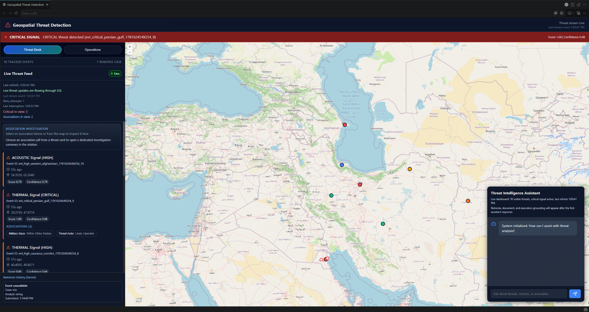
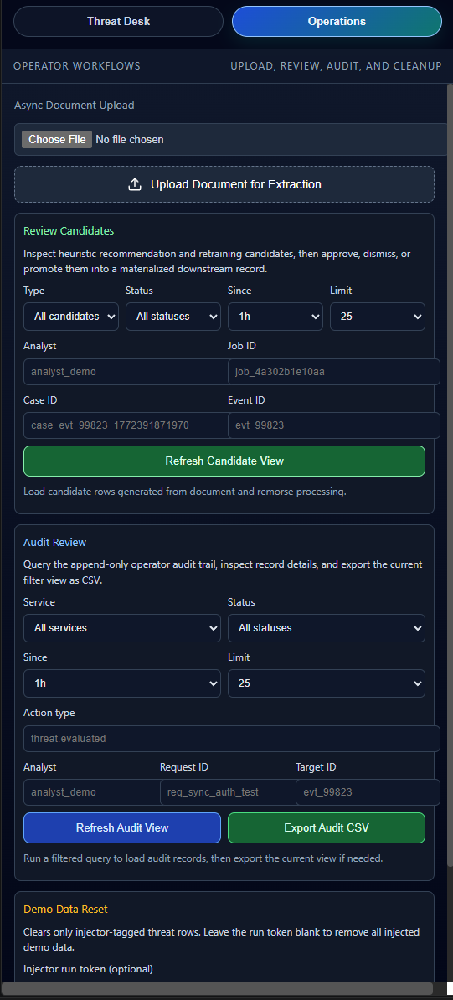
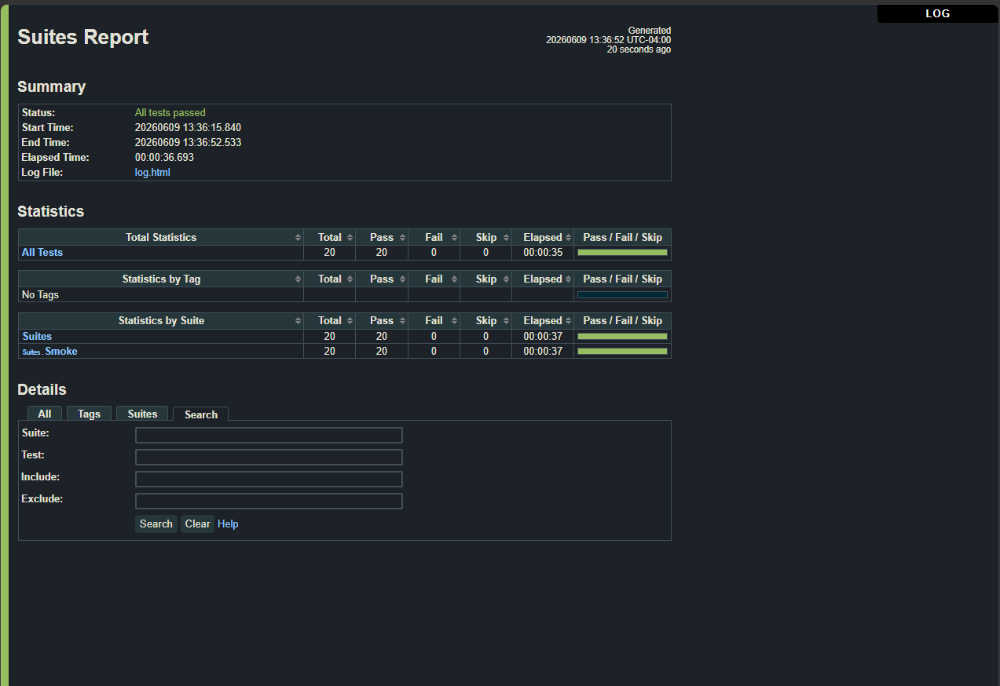
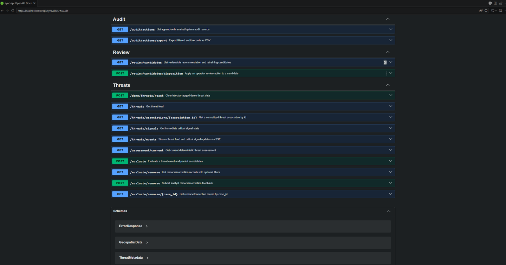
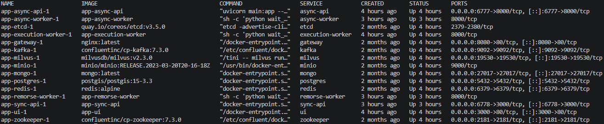
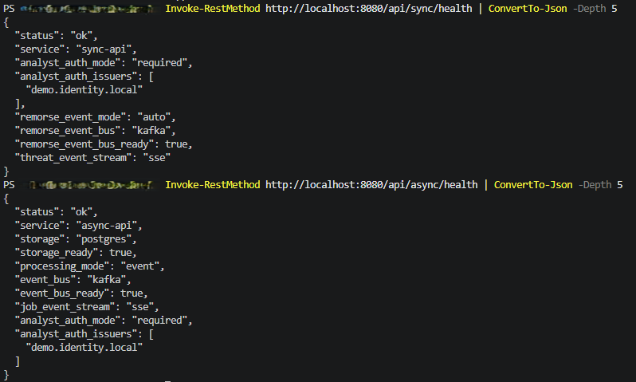
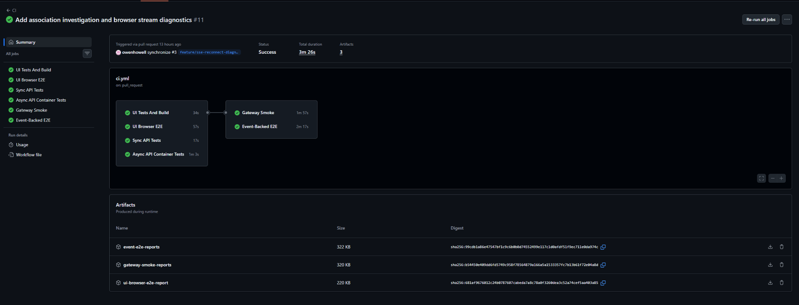

# QA, Systems, and Automation Portfolio

I’m Owen Howell. I’m focused on QA automation, API and integration testing, systems reliability, and technical process automation.

This portfolio highlights hands-on work with Robot Framework, Python, Docker/WSL2, Docker Compose, REST/JSON APIs, OpenAPI/Swagger, PowerShell, Bash, Git/GitHub, n8n, and LLM-assisted automation.

## Featured Project: MLAI Showcase

MLAI Showcase is a private demo project used to demonstrate QA automation, API and integration testing, Docker-based environments, systems reliability, and technical process automation.

Public evidence includes sanitized screenshots using synthetic local demo data, a reviewer-facing walkthrough, and test/runtime proof points.

**Review guide:** [MLAI Showcase: Project Review Guide](./walkthrough.md)

## Evidence Snapshot

| Evidence | What it shows |
| --- | --- |
| Analyst dashboard | React/OpenLayers UI, live threat feed, map markers, assistant panel |
| Operations workspace | Async upload, candidate review, audit export, demo cleanup |
| Robot Framework report | Gateway-routed smoke suite with 20 passing tests |
| CI pipeline | Successful private demo CI run covering UI test/build, browser E2E, sync API tests, async API container tests, gateway smoke, event-backed E2E, and report artifacts |
| Swagger/OpenAPI | Documented sync API contract |
| Docker Compose services | Multi-service runtime with UI, gateway, APIs, workers, and supporting services |
| API health validation | Sync and async health checks, storage readiness, service status |

## Screenshots

| Area | Preview |
| --- | --- |
| Analyst dashboard |  |
| Operations workspace: upload, review, audit |  |
| Robot smoke report |  |
| Swagger contract |  |
| Docker services |  |
| API health validation |  |
| CI pipeline |  |

## Technical Stack

- **Testing:** Robot Framework, smoke testing, regression testing, API testing, integration testing, contract validation, negative testing
- **Languages and scripting:** Python 3, PowerShell, Bash
- **Tools and environments:** Docker, Docker Compose, Linux on WSL2, Git, GitHub, VS Code
- **API/backend exposure:** REST/JSON, OpenAPI/Swagger, FastAPI exposure, Node/Express exposure, Postgres-backed testing exposure, async worker flows
- **Automation:** n8n, LLM-assisted workflows, document-to-data transformation, QuickBooks IIF import automation
- **Security and controls:** CompTIA Security+, access-control validation, traceability, exception handling, documentation, audit support

## Background Bridge

My background includes 9+ years in controls-heavy accounting, audit support, payroll, reporting, reconciliation, and process improvement. That experience shaped how I approach technical work: validate source-of-truth data, document expected versus actual outcomes, isolate exceptions, reduce manual risk, and build repeatable processes.

## Demo Access

MLAI Showcase source remains private so the review path stays controlled, sanitized, and focused. This public repo provides the reviewer-facing overview, screenshots, test/runtime evidence, and walkthrough material. Guided review of selected project areas is available upon request.

For review requests, please reach out through LinkedIn or the contact information on my resume.
