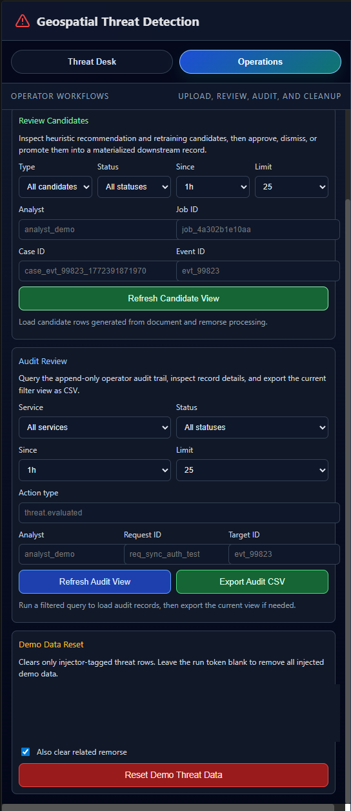

# QA, Systems, and Automation Portfolio

A public overview of my hands-on work in QA automation, API and integration testing, Docker-based environments, systems-oriented troubleshooting, and technical process automation.

Hi, I’m Owen Howell. I’m focused on QA automation, API and integration testing, systems reliability, and technical process automation.

My background combines 9+ years of controls-heavy accounting, audit support, payroll, reporting, reconciliation, and process improvement with hands-on technical work using Python, Robot Framework, Docker/WSL2, Docker Compose, REST/JSON APIs, OpenAPI/Swagger, Git/GitHub, PowerShell, Bash, n8n, and LLM-assisted automation.

I’m especially interested in roles where software quality, infrastructure, automation, documentation, security awareness, and business process reliability overlap.

## Current Focus

- QA automation and test engineering
- REST/JSON API testing
- Smoke, regression, negative, and end-to-end testing
- OpenAPI/Swagger validation
- Async workflow and job lifecycle validation
- Docker-based test environments
- Access-control and role-based validation
- Technical process automation using n8n and LLM-assisted workflows
- Security-aware testing and documentation

## Technical Stack

**Testing:** Robot Framework, API testing, smoke testing, regression testing, negative testing, end-to-end integration testing, contract validation

**Languages and scripting:** Python 3, PowerShell, Bash

**Tools and environments:** Docker, Docker Compose, Linux on WSL2, Git, GitHub, VS Code

**API and backend exposure:** REST/JSON, OpenAPI/Swagger, FastAPI exposure, Node/Express exposure, Postgres-backed testing exposure, async worker flows

**Automation:** n8n, LLM-assisted workflows, document-to-data transformation, QuickBooks IIF import automation

**Security and controls:** CompTIA Security+, access-control validation, audit support, traceability, exception handling, documentation, reconciliation, risk reduction

## Featured Project: MLAI Showcase

**Type:** QA automation and integration testing portfolio project  
**Visibility:** Private demo project  
**Review format:** Guided walkthrough available upon request  
**Focus:** Multi-service application testing, API validation, async workflow validation, Docker-based smoke testing

MLAI Showcase is a containerized multi-service portfolio project involving a React UI, gateway, sync and async APIs, worker processes, and repeatable smoke-test environments.

Testing coverage includes:

- Health check validation
- OpenAPI/Swagger availability checks
- Sync and async API contract validation
- JSON payload assertions
- File upload handling
- Result retrieval workflows
- Server-sent event update validation
- Queued-to-processing-to-completed job transition checks
- Negative test cases
- Expected versus actual outcome documentation

This project demonstrates my ability to test across multiple services, validate backend behavior, document issues clearly, and use repeatable environments to support stronger delivery

## MLAI Showcase Walkthrough Preview

MLAI Showcase is a private demo project used to demonstrate QA automation, API and integration testing, Docker-based environments, systems reliability, and technical process automation.

This public portfolio includes sanitized screenshots using synthetic local demo data. The screenshots show the application surface, operator workflows, API contract, Dockerized runtime, and automated smoke-test evidence without exposing private repo contents, secrets, local paths, or raw test artifacts.

For a reviewer-friendly overview, see [MLAI Showcase: Project Review Guide](./walkthrough.md).

## Screenshots

| Area | Preview |
| --- | --- |
| Analyst dashboard |  |
| Operations workspace: upload, review, audit |  |
| Operations workspace: audit and reset controls |  |
| Robot smoke report |  |
| Swagger contract |  |
| Docker services |  |
| API health validation |  |

## Process Automation Case Study

In my current work, I built LLM-assisted and n8n-based automation workflows to transform large exports and PDF-derived data into structured QuickBooks IIF imports.

The workflow reduced a recurring manual process from approximately 40 hours per month to approximately 5 hours per month while lowering data-entry risk.

This case study reflects the same mindset I bring to QA automation: understand the workflow, identify risk points, build repeatable validation, reduce manual effort, and document the process clearly.

## What I’m Looking For

I’m pursuing roles in:

- QA Automation
- Software Testing
- API Testing
- Test Engineering
- Systems Administration
- Technical Support Engineering
- Process Automation

I’m especially interested in roles where QA, automation, infrastructure, security awareness, and business process reliability overlap.

## Demo Access

Some demo repositories are kept private to keep the review path controlled and avoid exposing unfinished or unrelated work.

Guided walkthroughs of selected demo projects are available upon request.
